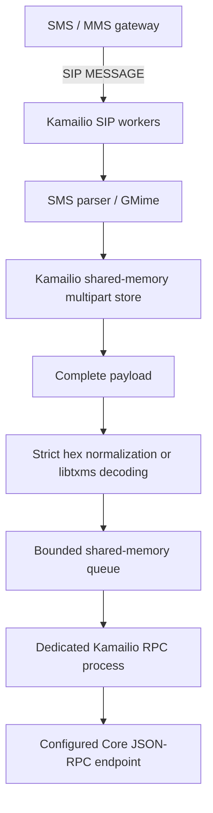

# Kamailio TxMS module

Native `txms.so`: receive SIP MESSAGE, reconstruct SMS, decode TxMS with [libtxms](https://github.com/DataLayerHost/libtxms), and queue transactions for a dedicated Core JSON-RPC worker. The module source is MIT licensed. libtxms is separately CORE licensed; Kamailio and linked dependencies retain their own licenses.

## Architecture



Only the RPC child performs HTTP networking. SIP workers parse messages and stage atomic updates in Kamailio shared memory (`shm_malloc`/`shm_free`), protected by a native process-shared lock. Lock contention rejects the request immediately so the gateway can retry. No database server, tables, files, or Kamailio database modules are required.

**State is volatile:** restarting Kamailio loses incomplete messages, queued transactions and duplicate markers. Use this deployment model when the upstream gateway can recover undelivered messages and the node can identify already submitted transactions.

## Build and install

Check out the repositories as siblings:

```text
workspace/
  kamailio-txms/
  libtxms/
  kamailio/       # matching source for the deployed Kamailio release
```

Linux dependencies (Debian 12):

```sh
sudo apt-get install build-essential cmake pkg-config libcurl4-openssl-dev \
  libjson-c-dev libgmime-3.0-dev bison flex libssl-dev libpcre2-dev
make test
make sanitize
```

macOS core/parser tests: `brew install cmake pkg-config curl json-c gmime`, make the Homebrew pkg-config directories visible, then `make test`. The native Kamailio module is built and exercised on Linux. Requirements: C11, curl ≥7.85, json-c ≥0.15, GMime 3.2.13 or later. Both old and new GMime warning callback signatures are detected by CMake.

```sh
# Build production libraries without sanitizer flags.
cmake -S . -B build -DCMAKE_BUILD_TYPE=RelWithDebInfo -DTXMS_SANITIZE=OFF
cmake --build build -j
# Configure the matching Kamailio source first using its normal build procedure.
make KAMAILIO_SRC=/absolute/path/to/kamailio module
# Install to the modules directory used by that Kamailio installation:
install -m 755 /absolute/path/to/kamailio/src/modules/txms/txms.so /your/kamailio/modules/
```

`make module` copies only this module into `src/modules/txms` in the selected Kamailio tree. It links the separately built static gateway/libtxms libraries; GMime, curl and json-c remain runtime dependencies. Tested against Kamailio 6.0 source commit `fc962fb165b7daad7885210763447bb215f1a0ef`. Always build against the exact deployed Kamailio version and build flags.

Run the service as its dedicated user. Allocate enough Kamailio shared memory for TxMS and other modules, for example `kamailio -m 128` (128 MiB). TxMS defaults to a 32 MiB state allocation budget, excluding allocator overhead. Allocation failure rejects the current batch without publishing partial updates.

## Configuration and routing

See [.env.example](.env.example) and [examples/kamailio.cfg](examples/kamailio.cfg). Environment values must be exported by the service manager; the module does not load dotenv files. Explicit module parameters override environment values.

| Environment | Module parameter | Default |
| --- | --- | --- |
| `CORE_RPC_URL` | `rpc_url` | Required |
| `CORE_RPC_METHOD` | `rpc_method` | Required |
| `CORE_RPC_USERNAME` | `rpc_username` | Empty |
| `CORE_RPC_PASSWORD` | `rpc_password` | Empty |
| `CORE_RPC_TOKEN` | `rpc_token` | Empty |
| `CORE_RPC_TIMEOUT_MS` | `rpc_timeout_ms` | 10000 |
| `CORE_RPC_TLS_VERIFY` | `rpc_tls_verify` | `true` / parameter `1` |
| `TXMS_MULTIPART_TTL` | `multipart_ttl` | 3600 seconds |
| `TXMS_MAX_MULTIPART_MESSAGES` | `max_multipart_messages` | 10000 |
| `TXMS_MAX_PARTS` | `max_parts` | 32 |
| `TXMS_MAX_MESSAGE_BYTES` | `max_message_bytes` | 2097152 |
| `TXMS_MAX_JOBS` | `max_jobs` | 10000 |
| `TXMS_MAX_QUEUE_BYTES` | `max_queue_bytes` | 67108864 |
| `TXMS_JOB_TTL` | `job_ttl` | 3600 seconds |
| `TXMS_MAX_STATE_BYTES` | `max_state_bytes` | 33554432 |
| `TXMS_CLEANUP_INTERVAL` | `cleanup_interval` | 10 seconds |
| — | `sms_framing` | 2: RP-DATA; 0: TPDU; 1: SMSC PDU |

Timeout range: 1–300000 ms; multipart/job TTL 1–604800 seconds, cleanup interval 1–3600 seconds, parts ≤255, body ≤2 MiB, messages/jobs ≤100000, segment/queue byte budget ≤128 MiB, total state budget ≤512 MiB (and large enough for the index). Invalid settings prevent startup. Never configure both bearer and basic authentication. Redirects and URL-embedded credentials are rejected; TLS verification is enabled by default.

```kamailio
if (is_method("MESSAGE")) {
  if (txms_process_and_submit()) {
    sl_send_reply("200", "Accepted");
    exit;
  }
}
```

A successful SIP reply means a segment was stored, a duplicate was recognized, or a complete batch was queued. **It does not confirm blockchain acceptance.** Acceptance is held in memory until submission or expiry. Functions return 1 for complete, 2 for incomplete/duplicate, -1 for rejection/storage failure. Script functions are available in request routes:

- `txms_process()`: stores incomplete segments and inspects complete transactions.
- `txms_is_complete()`: true only for a complete result from the current request.
- `txms_get_transaction("$var(tx)")`: writes the newline-separated normalized batch into a writable pseudo-variable (load `pv.so` when using `$var`).
- `txms_submit()` and `txms_process_and_submit()`: atomically process and enqueue the current MESSAGE.

Inspection of a complete multipart is rolled back; submit reprocesses the request and commits assembly plus queue insertion together. This avoids consuming a final segment when the queue is full. Do not modify the MESSAGE body between inspection and submission.

## Gateway formats and SMS

| Content-Type | Accepted wire content |
| --- | --- |
| `text/plain` | UTF-8 TxMS or strict hex; optional `charset=utf-8`, `us-ascii`, or `utf-16be` |
| `application/vnd.3gpp.sms` | Binary RP-DATA, TPDU or SMSC PDU as configured |
| `application/octet-stream` | Same explicitly configured binary SMS framing |
| `multipart/*` | Bounded GMime parsing of actual delivered MIME content |

The binary parser implements SMS-DELIVER, numeric/alphanumeric originating addresses, raw SCTS timestamp, DCS, UDHI, UDL, GSM-7 default/extension tables and UDH septet alignment. It preserves original PDU bytes in `gw_sms.original`. SMS-DELIVER has no recipient address: the SIP To URI supplies the destination. RP envelope addressing is not substituted for that recipient. Numeric addresses are limited to 20 digits. Unsupported compression, national language shift tables, reserved DCS, other TPDU types and application-port-addressed data are rejected.

GSM septets and UTF-16BE bytes are reassembled before conversion, including split escapes and split surrogate pairs. DCS 8-bit data is preserved; it must subsequently contain UTF-8 TxMS or hex under the gateway's contract. It is not guessed to be a serialized raw blockchain transaction. Hex-printed PDUs are not accepted as binary PDUs: configure the gateway or an explicit upstream adapter to deliver binary.

The normalized C result records from/to, transport, content type, multipart reference/count, encoding, original segment length and transaction hex. It does not log message content. Raw PDU metadata is available to parser consumers during processing, not persisted to the production queue.

## Multipart concurrency and limits

The parent initializes the shared store before forking. All SIP workers, the RPC child and the cleanup timer access the same state through Kamailio's locking API. Assembly and batch enqueue are staged while holding the lock; commit publishes both without further allocation, and failures roll back together. The group key contains length-prefixed sender and destination, reference width/value, total parts, exact DCS and SCTS calendar day. Different destinations, encodings and reference widths do not collide.
Identical segments are deduplicated; conflicting bytes for an existing sequence are rejected. Completion frees segment bodies and leaves a duplicate marker until TTL expiry. TTL is measured from first arrival, never extended by duplicates. A Kamailio timer frees expired groups even when no messages arrive. A matching expired group is also removed before accepting new parts. Timeouts use a monotonic clock. Missing parts never emit transactions. Day boundaries intentionally form separate groups; a message spanning midnight can expire incomplete.

**SMS carries no globally unique multipart identifier.** Disjoint segments from same-day reuse of every key field cannot always be distinguished. Require gateways to avoid reusing a reference within the TTL for the same sender/destination/encoding, or add an authenticated provider generation identifier before deployment in that environment. This cannot be solved reliably from an 8-bit reference alone.

The byte budget applies separately to stored segment bodies and retained transaction hex. Completed groups count toward the group limit; terminal jobs count toward job limits until expiry. `max_state_bytes` additionally bounds all requested shared allocations, including indexes, metadata and staged updates. Limits reject new work without evicting unexpired messages. The timer skips a cleanup cycle if the lock is busy; expired jobs cannot be newly claimed between timer runs.

## MMS support and limitations

MMS works only when the gateway delivers actual text or MIME attachments. The MIME parser supports text/plain and `.txms.txt` attachments, multiple attachments, base64/quoted-printable transfer decoding, and newline batches. It rejects parsing warnings, unsupported parts, nested message containers, unsupported charsets, more than 128 parts, nesting beyond 8, input over 2 MiB and aggregate decoded transaction text over 2 MiB. No archives are unpacked. Unknown attachments cause rejection rather than silent partial submission.

Bare HTTP(S) notification URLs, WAP MMS content types and SMS application-port data (including WAP Push) return `GW_UNSUPPORTED`. They are not fetched. A future provider adapter must authenticate notifications, authorize retrieval targets, bound responses and deliver explicit MIME content. The SIP gateway's MMS contract is required before adding such an adapter.

## Core RPC and recovery

The operator must supply the broadcast method verified for their Core node. No production endpoint or broadcast method is guessed. The request is JSON-RPC 2.0 with a unique local job ID string and `params: ["0x…"]`. A successful response must have matching ID/version and a nonempty string result, as expected for a transaction identifier. Verify that response contract as well as the method against the selected node.

RPC connection timeout is at most 3 seconds; total timeout is configurable. Responses are capped at 64 KiB and JSON depth 16. HTTP errors, oversized/malformed replies, wrong IDs, conflicting result/error members, timeouts and connection errors are treated as **uncertain**, with no automatic retry. A valid RPC error is recorded as rejected. Passwords, tokens, authorization headers, response bodies and transaction data are never logged by the module.

Queue state lives in shared memory:

| Status | Meaning |
| --- | --- |
| 0 | Queued, not claimed |
| 4 | Sending; protected from expiry during the HTTP request |
| 1 | RPC success |
| 2 | RPC rejection |
| 3 | Uncertain network/HTTP/protocol outcome |

`kamcmd txms.stats` reports groups, jobs, queued/sending/succeeded/rejected/uncertain counts, segment bytes, transaction bytes and allocated state bytes. Enable Kamailio's `ctl` module for `kamcmd`, or use another configured Kamailio RPC transport. Stats contain no transaction payloads; a busy store returns a retryable 503 error.

Exact normalized transaction hex is deduplicated across all retained jobs. Pending jobs expire `job_ttl` seconds after enqueue; expiry of unsent jobs logs a warning. Terminal jobs expire `job_ttl` seconds after completion. Cleanup removes payloads and duplicate markers. Active HTTP jobs never expire; the worker records the outcome before retention starts. A worker crash requires restarting the service; there is no automatic reclamation or retry of an active job.

After expiry or restart, the same transaction can be accepted again. Check the node before manually resubmitting uncertain transactions. This module does not provide durable delivery or permanent duplicate suppression. If replacing the earlier database implementation, remove `db_path`/`TXMS_DB_PATH` from configuration. Existing database files are neither read nor deleted; reconcile any previously queued jobs before retiring those files.

## Tests and troubleshooting

```sh
make test
make sanitize
python3 tests/sip_integration.py /path/to/built/kamailio
CC=clang cmake -S . -B build-fuzz -DTXMS_FUZZ=ON -DTXMS_SANITIZE=ON
cmake --build build-fuzz
build-fuzz/fuzz_sms -runs=20000 -max_len=512
build-fuzz/fuzz_udh -runs=20000 -max_len=141
build-fuzz/fuzz_mime -runs=5000 -max_len=4096
build-fuzz/libtxms/txms_fuzz -runs=20000 -max_len=2048
```

Tests cover PDU framing, GSM-7 alignment/extensions, UTF-16, UDH, ordered/out-of-order assembly, duplicates/conflicts, TTL, destination separation, cross-process state, MIME attachments, volatile state reset, idle cleanup, protected in-flight jobs, allocation failure rollback and RPC success/error/timeout/malformed replies. Live integration starts a real Kamailio with two SIP workers and a local mock RPC endpoint. No test submits to a public blockchain. Sample MESSAGEs are in [tests/fixtures](tests/fixtures).

Build failures: check pkg-config dependency paths and exact Kamailio ABI. Startup failures: check required method/URL and available shared memory. Rejected binary messages: check framing, Content-Length, DCS and whether the provider sent RP-DATA or a hex dump. Incomplete messages: check reference/destination consistency, SCTS dates and expiry. Accepted SIP without RPC success: inspect queue states and worker logs. Logs expose job IDs/outcome numbers only.

The first release still needs provider interoperability tests, sustained load testing, and independent security review before production use.

## Protocol sources

- [TypeScript codec](https://github.com/bchainhub/txms.js) and [Dart cross-check](https://github.com/bchainhub/flutter_txms); pinned provenance and Unicode behavior in libtxms.
- [3GPP TS 23.040 SMS layout](https://www.etsi.org/deliver/etsi_ts/123000_123099/123040/18.00.00_60/ts_123040v180000p.pdf), TS 23.038 alphabet and TS 24.011 RP envelope.
- [GMime](https://github.com/jstedfast/gmime), [Kamailio memory and locking APIs](https://www.kamailio.org/docs/kamailio-devel-guide/), [JSON-RPC 2.0](https://www.jsonrpc.org/specification).
- Kamailio source `doc/tutorials/modules_init.txt`: process registration/fork lifecycle used by the module.

## GitHub releases and dependency versions

[release.yml](.github/workflows/release.yml) starts when a stable GitHub Release
is **published**, using tags such as `0.1.0` without a `v` prefix. Publishing a
release starts the complete CI workflow at its tagged commit. Assets are attached
only after macOS/Linux sanitizers, fuzz checks, release-tool validation and live
Kamailio integration pass. The release itself is already visible while tests run;
a failed check prevents asset uploads. The tag must match `CMakeLists.txt`.

Gateway CI always selects the latest published stable libtxms release through
GitHub's `releases/latest` API. It resolves that release once per run, then uses
the same exact commit for every build and test. Drafts and prereleases are excluded;
a library release must exist before gateway CI can run. There is no branch fallback.
The library tag must use `MAJOR.MINOR.PATCH` without `v` and match its CMake version.

There are no fixed library version or revision files to update. Each plugin
release records the actual tested library version and commit in `release.json`.
A new CI run picks up the latest release; an installed plugin changes only when
rebuilt and deployed. Locally, check out the latest libtxms release as the sibling
repository before building (the local build does not fetch or replace your checkout).

Commit and push the workflow/version changes, then create and publish a GitHub
Release for the matching tag (for example `0.1.0`) through GitHub's Releases page.
Pushing a tag alone does not run the release workflow. Prereleases are skipped.

After tests succeed, the workflow uploads `kamailio-txms-0.1.0.tar.gz`,
`release.json` and `SHA256SUMS` to that existing release using the repository token.
The source archive contains the exact tested commit. Existing assets are not
overwritten. No generic `txms.so` binary is distributed because it must be built
against the operator's Kamailio ABI. Check out the libtxms commit recorded in
`release.json` as a sibling and follow the build/install instructions above.

## Conan and ignored files

Local Conan packaging lives in
[libtxms](https://github.com/DataLayerHost/libtxms), the reusable C library.
The native Kamailio plugin is distributed through this repository's source
releases and built using Kamailio's build system. ConanCenter publication is disabled.

Both repositories ignore generated build outputs, binaries, local Conan state,
Python environments, generated CMake user presets and reference checkouts.
No lockfiles are needed by the current build and none are committed. The library
version and commit are recorded per release, and assets have SHA-256 checksums. Local
configuration stays ignored while `.env.example` remains tracked.
